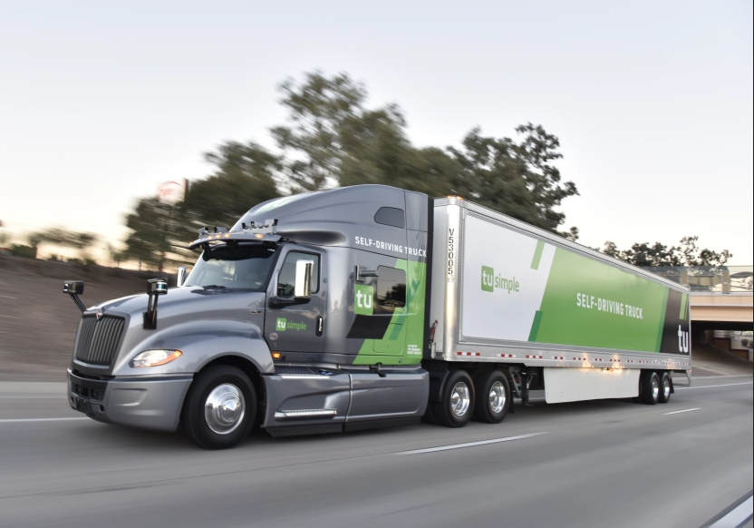
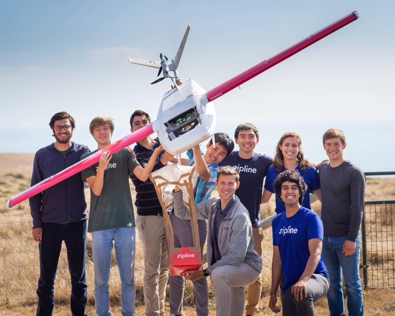

Hi! I'm Blake, and I'm a master's student at the University of Michigan studying robotics.

# Experience
I've worked on software and hardware design at several robotics companies:

### [Carnegie Robotics](https://carnegierobotics.com/) (September - December 2020, Remote)
I had two projects as a software engineer intern. I built, from scratch, an extrinsic camera calibration tool using Ceres bundle adjustment in C++. I also implemented a new localization algorithm, along with a set of evaluation tests, using OpenCV, for a structure from motion pipeline on a mobile robot. 

### [Tusimple](https://www.tusimple.com/) (May - August 2020, Tucson, AZ)
I improved Tusimple's sensor evaluation process by automating the point cloud segmentation of calibration targets, using a custom RANSAC algorithm in Python. I also designed thermal, electrical, and vibration tests for five different sensing modalities. Finally, I performed root-cause analysis of IMU resonant frequency response on an autonomous truck. 

  

### [Zipline](https://flyzipline.com/) (June - August 2019, Half Moon Bay, CA)
Zipline builds a drone-based medical delivery network for emergency medical supplies in developing countries and the US. I researched and selected sensors to support an onboard aircraft detection and avoidance system, and built a functional hardware prototype with an aircraft-based sensor.
I also upgraded aircraft launcher hardware equipment to improve reliability, assembly time, and field operations, and successfully installed the new design at a production facility and wrote a field rework procedure.

  

### [DJI](https://enterprise.dji.com/) (May - August 2018, Palo Alto, CA)
I interned with the Oboard SDK team at DJI, which was developing a drone-based Lidar system. I built the hardware for a fully-functional prototype of the system, to enable the software team to develop algorithms for real-time 3D scanning. I performed vibration isolation and stiffness analyses of my mounting brackets to meet the requirements of the inertial navigation system. The designs I created, shown below, can also be seen in [our patent](https://patents.google.com/patent/WO2020092179A1/).

  

* * *

# Education

I'm a current M.S. student in the [University of Michigan's Robotics](https://robotics.umich.edu/) program, graduating May 2021.

I graduated from Texas A&M University with a B.S. in Mechanical Engeering, Magna Cum Laude, with Engineering Honors. I worked with the [Unmanned Systems Lab](https://unmanned.tamu.edu/) on building a drive-by-wire shuttle platform.

  

* * *

# Projects
[star_align:](https://github.com/bkarwoski/star_align) Align and combine multiple star photos, to create images like this page's header. This is a re-write of a [tool I'd made in python](https://github.com/bkarwoski/StarStack), to get more familiar with CMake and working with libraries like [OpenCV](https://github.com/opencv/opencv).

[Tree search controller:](https://github.com/bkarwoski/p4r) A three-part multithreaded project, written in pure C:
* A 2D physics simulator with collision resolution
* A tree search recursive path planner
* A graphics generator for display and debugging

  

[Deepfake Detection:](https://arxiv.org/pdf/2006.14749.pdf) I implemented a frequency domain approach for detecting artificially created images, and trained it to classify fake videos from the Celeb-DF dataset.

# Involvement

In my spare time, I supervise events for [Science Olympiad](https://www.soinc.org/) tournaments, a team-based science competition for middle & high school students.

I also helped run [TAMUhack](https://tamuhack.com/), Texas A&M's annual student hackathon. I set up hardware (arduinos, soldering stations, 3D printers) for the event and built trophies & banners.

# Contact

Feel free to reach out! You can reach me at myfirstname.mylastname at gmail dot com. 